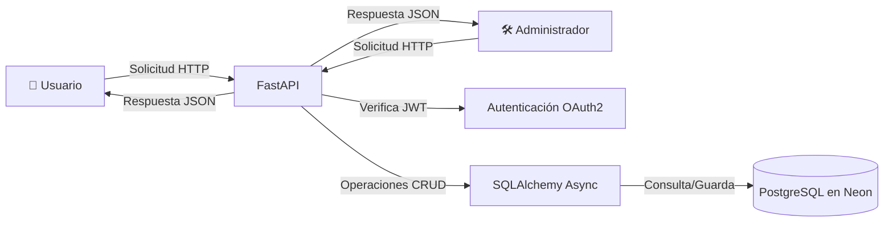

# 🥊 SolBox - API de Boxeo Generacional

[](https://github.com/RAMXG777/mi-backend-2026)
[](https://fastapi.tiangolo.com/)
[](https://www.python.org/)
[](https://www.postgresql.org/)
[](https://jwt.io/)
[](LICENSE)

> **"Una API Backend que crea y gestiona boxeadores, establece peleas y torneos usando PostgreSQL, autenticación JWT, roles de usuario/admin y FastAPI."**

---

## 🚀 Propuesta de Valor

**SolBox** es una API dinámica que permite crear boxeadores, establecer torneos y peleas interesantes, almacenándolos en una base de datos relacional. Sirve para explicar de forma fácil y entretenida cómo funciona FastAPI, PostgreSQL, la autenticación con JWT y el manejo de roles sin necesidad de buscar guías genéricas o aburridas.

**Ideal para:** desarrolladores que quieren revisar documentación real para guiar su aprendizaje de una forma más entretenida y no tan monótona como lo haría un programa tradicional.

---

## ⚡ Características Principales

- **🔐 Seguridad y carga automática de credenciales** mediante archivo `.env`.
- **☁️ Conexión segura y estable** a la base de datos en la nube (Neon.tech).
- **🧩 Uso de modelos ORM** para una conexión y manejo de base de datos más estable.
- **🔁 Dependencia segura de creación de sesiones** para usarla automáticamente en cada endpoint sin tener que abrir y cerrar sesión constantemente.
- **🔑 Autenticación y manejo de login** usando OAuth2 con JWT.
- **🛡️ Control de roles:** `user` (para procesos públicos) y `admin` (para gestión).

---

## 🏗️ Arquitectura del Sistema



---

## 📊 Matriz de Funcionalidades por Rol

| Función | Usuario | Admin |
| :--- | :---: | :---: |
| Registro / Login | ✅ | ✅ |
| Ver boxeadores | ✅ | ✅ |
| Crear boxeador | ❌ | ✅ |
| Actualizar boxeador | ❌ | ✅ |
| Eliminar boxeador | ❌ | ✅ |
| Ver peleas | ✅ | ✅ |
| Crear torneo | ❌ | ✅ |

---

## ⚡ Inicio Rápido

### 🔧 Instalación local

```bash
# Clonar el repositorio
git clone https://github.com/RAMXG777/mi-backend-2026.git
cd mi-backend-2026

# Crear entorno virtual
python -m venv .venv
source .venv/bin/activate   # Linux/macOS
# .venv\Scripts\activate    # Windows

# Instalar dependencias
pip install -r requirements.txt

# Crear archivo .env con tus credenciales
cp .env.example .env
# Edita .env con tus datos de Neon y SECRET_KEY

# Ejecutar migraciones (opcional)
alembic upgrade head

# Levantar servidor
uvicorn main:app --reload
```

### 🐳 Con Docker (opcional)

```bash
docker build -t solbox-api .
docker run -p 8000:8000 --env-file .env solbox-api
```

---

## 📡 Endpoints Principales

| Método | Ruta | Rol | Descripción |
| :--- | :--- | :--- | :--- |
| POST | `/register` | Público | Registro de usuario |
| POST | `/token` | Público | Login y obtención de JWT |
| GET | `/entrenadores/me` | Usuario | Datos del perfil autenticado |
| GET | `/boxeadores/` | Usuario | Lista de boxeadores |
| POST | `/boxeadores/` | Admin | Crear boxeador |
| PUT | `/boxeadores/{id}` | Admin | Actualizar boxeador |
| DELETE | `/boxeadores/{id}` | Admin | Eliminar boxeador |
| GET | `/peleas/` | Usuario | Lista de peleas |
| POST | `/torneos/` | Admin | Crear torneo |
| GET | `/health` | Público | Estado del servidor |

---

### 📥 Ejemplos de Petición / Respuesta

<details>
<summary><b>📝 Registro de usuario (POST /register)</b></summary>

**Petición:**

```json
POST /register
{
  "username": "campeon",
  "email": "campeon@boxeo.com",
  "password": "mi_contraseña_segura"
}
```

**Respuesta (201 Created):**

```json
{
  "id": 1,
  "username": "campeon",
  "email": "campeon@boxeo.com",
  "role": "user"
}
```

</details>

<details>
<summary><b>🔑 Login (POST /token)</b></summary>

**Petición (form-data):**

```bash
username=campeon&password=mi_contraseña_segura
```

**Respuesta (200 OK):**

```json
{
  "access_token": "eyJhbGciOiJIUzI1NiIsInR5cCI6IkpXVCJ9...",
  "token_type": "bearer"
}
```

</details>

<details>
<summary><b>👤 Obtener perfil (GET /entrenadores/me)</b></summary>

**Header:** `Authorization: Bearer <tu_token>`

**Respuesta (200 OK):**

```json
{
  "id": 1,
  "username": "campeon",
  "email": "campeon@boxeo.com",
  "role": "user"
}
```

</details>

<details>
<summary><b>📋 Listar boxeadores (GET /boxeadores/)</b></summary>

**Header:** `Authorization: Bearer <tu_token>`

**Respuesta (200 OK):**

```json
[
  {
    "id": 1,
    "nombre": "Ippo",
    "peso": 57.5,
    "altura": 165,
    "estilo": "Peek-a-boo"
  }
]
```

</details>

---

## 🛡️ Seguridad y Manejo de Errores

### 🔒 Seguridad

- **Contraseñas:** Protegidas mediante hashing con `bcrypt`. Nunca se almacenan en texto plano.
- **Tokens:** JWT firmados con `HS256` y expiración de 30 minutos.
- **Roles:** `user` y `admin` gestionados en el registro. Al intentar acceder a endpoints clave (POST, PUT, DELETE), una dependencia filtra el acceso.
- **Variables de entorno:** Todas las credenciales (base de datos, secret key) se cargan desde un archivo `.env`.
- **CORS:** Configurable según entorno.

### ⚠️ Códigos de estado HTTP

| Código | Significado |
| :--- | :--- |
| 200 | OK |
| 201 | Creado |
| 204 | Sin contenido |
| 400 | Solicitud incorrecta |
| 401 | No autenticado |
| 403 | Prohibido (sin permisos) |
| 404 | Recurso no encontrado |
| 409 | Conflicto (nombre duplicado) |
| 422 | Error de validación |

---

## 🧪 Pruebas y Cobertura

**Próximamente.** Actualmente el proyecto está en fase de desarrollo activo. Las pruebas unitarias y de integración se añadirán en futuras versiones.

```bash
# (Comando futuro)
pytest
pytest --cov=.
```

---

## 📄 Licencia y Contribución

**Licencia:** MIT

**Contribuciones:** Las contribuciones son bienvenidas. Abre un Issue o un Pull Request en el repositorio.

---

**Hecho con ❤️ y FastAPI.**
